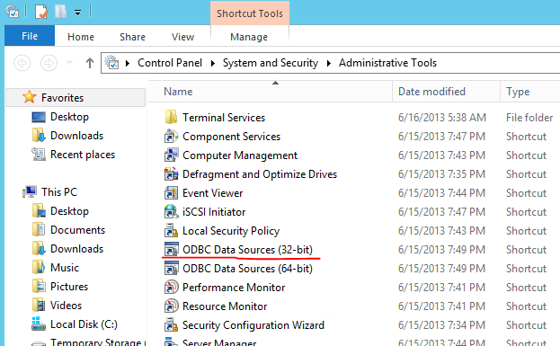
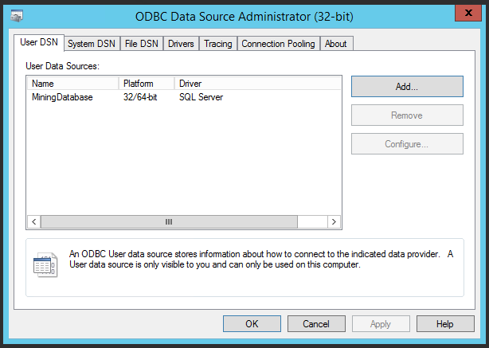
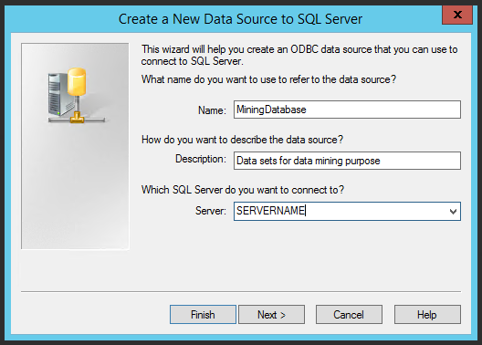
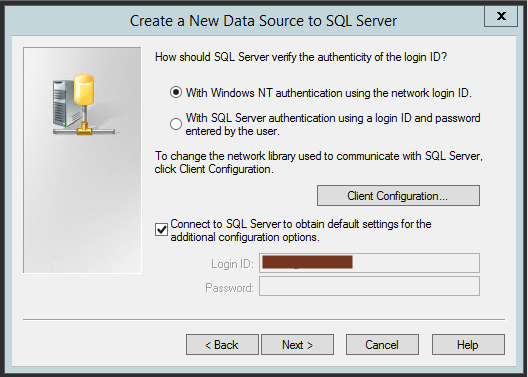
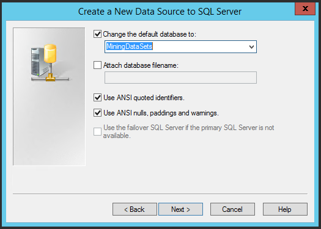
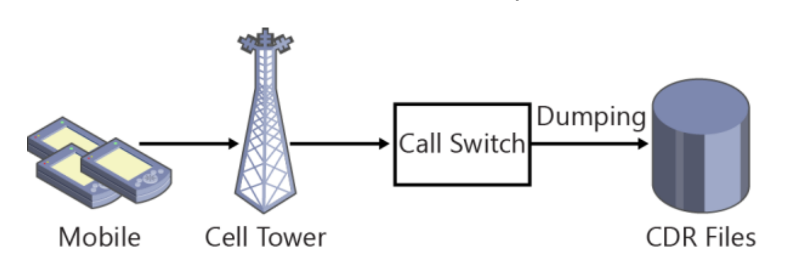

```{r setup, include=FALSE}
knitr::opts_chunk$set(echo = TRUE)
```

# General Introduction

As far as we're concerned, those who might be interested in reading a Data Science Project Report will either be Data Scientists or people who recognize the importance and the potential gains from Data Sciene. From Data Scientist to Data Scientist, both of us acknowledge its importance, thus we won't waste any time speaking of the possible insights we can obtain or the knowledge at the tip of our fingers.

However, what we should speak of comes from a practical perspective: As Data Scientists, we expect data to work with. Often, the data will be provided in raw CSV or JSON formats and we can peacefully work with it as we always do, with R or Python or whatever weapon we have at our disposal. But more often than not, the data is in operational databases and we are given access tokens, not data. There comes the necessity of working directly within the server.

Microsoft gave the matter a thought, and with Microsoft R Services comes a whole world of possibilities where we can use the Server's processing power, and immediate access to the data through modeling within the Server itself.

This project is an academic project, thus it is not designed for operational use. Instead, it is meant to provide maximum technical knowledge through tutorial-like structure.

# Chapter 0 : Stack Configuration 

## Introduction

In this chapter, we will introduce the basics on how to configure an existing SQL Server Installation or install a new SQL Server Installation to implement Microsoft R Services and how to link an R Session to an existing SQL Server outside of the Server (as we will need to in order to make Data Visualization).

## 0.1 Motivation:

As this project is academic in nature, familiarization with SQL Server is a necessary step. Reproduction of this work is impossible as long as there isn't a proper installation of SQL Server with Microsoft R Services on the device.

## 0.2 Setting up the environment:

A link towards a more precise tutorial was provided in the References part at the end of this report. We will write in the following titles the most important notes of the configuration.

### 0.2.1 SQL Server 2016 SP1:

You will be required to download and install SQL Server 2016 SP1 in its Developer license (Express won't be enough and Evaluation gives you the same features for commercial goals but only for 180 days). The pack already has Microsoft R Services and you will need to tick it during the installation.

A little note related to the architecture: After installing Microsoft SQL Server 2016 SP1, you will have to check your services (Start Menu => Services) to find one called SQL Server Launchpad. The Launchpad is the service managing the Server's relationship with Machine Learning sessions (here only including R, but SQL Server 2017 has Python support). It must be running, otherwise no R script can be activated.

### 0.2.2 SQL Server Management Studio 17.7:

You will also be required to download and install SQL Server Management Studio 17.7 after installing SQL Server. You will connect using the Microsoft Authentification you chose in the previous step.

A little note related to the execution of R scripts within the SQL Server Management Studio: You must activate the execution of external scripts within the server's configuration table. Modifying the external scripts table requires you to restart the Management Studio.

### 0.2.3 Getting the Data:

We will be using sample Call Detail Records (CDR) data from Telco. You'll have to download it from github (link in the References) and restore it in the SQL Server Management Studio. ("Restore database SQL Server" are the key words here if you don't know what to do. Google it)

### 0.2.4 Side note - RStudio:

We'll be using RStudio to draft this report along with every step before Modeling and Evaluation. A link to download RStudio has been provided.

## 0.3 Connecting a local R session to SQL Server:

If you're on Windows and you recently did all the previous steps, and if you want to access the SQL Server Database on your local R Session, you're going to have to configure the device containing the server to allow for an ODBC Data source.

#### Administrative Tools

Head to the Administrative Tools from your Start Menu

```{r Administrative, echo=FALSE, fig.cap="Administrative Tools"}

```

#### View list of ODBC Data Sources

Here's the list of our current ODBC Data Sources. If all goes well, you'll find an entry just like this one on the list. Press Add to start configuring your new ODBC Connection.

```{r ODBC, echo=FALSE, fig.cap="View list of ODBC Data Sources"}

```

#### Establish Server Connection

You'll find your Server's name in the list. Click to select it. The name of our ODBC Connection shall be MiningDatabase but you are free to choose any name you see fit, provided you reuse it in the next chapter detailing the data visualization.

```{r Connection, echo=FALSE, fig.cap="Establish Server Connection"}

```

#### Set identification method

Choose your mode of Authentification. If you have followed the previous instructions, you'd have chosen Windows NT Authentification, although if you're working on a company SQL Server, means may vary.

```{r identification, echo=FALSE, fig.cap="Set identification method"}

```

#### Set default database

Set the default Database you're planning to use. Now, in our case, we'll be using the churn database we have previously restored.

```{r database, echo=FALSE, fig.cap="Set default database"}

```

## Conclusion

Now you should have the necessary resources to start working. Setting the stack is particularly important because any mistake in this general area and that means that no matter what you do and no matter how skilled in algorithmics you are, you will never be able to deploy your model correctly, thus your entire work expertise is no longer usable.

# Chapter I : Business understanding

## Introduction

in this step, we will be discussing the main aims of this project, or more appropriately, its "Business Objectives" and "Data Science Goals". We will also be providing enough context to help the reader understand the general situation leading to this project.

## 1.1 Project Context

This is an academic project designed to initiate the learner to Microsoft R Services through the application of a churn model on an active SQL Server.

In Data Science, predicting customer churn is a traditional exercise. It is to be noted that customer transactional data is often stored in a Relational Database Management System (RDBMS) such as Microsoft SQL Server. Companies have management systems and built-in applications which allows access to it to support their staff. It is important when trying to improve a pre-established system not to force the staff to relearn a new application in order to capitalize in their experience and not have any loss of efficiency. It is therefore the responsibility of database developers to put a churn model into action and deploy it in such a way that the staff can make better decisions without needing to learn something new.

Using Microsoft R Services, it is now possible to use models that were otherwise complicated to implement using classical Transact-SQL through taking full advantage of R's rich collection of machine learning libraries. This also allows for any calculations to be done in the database server, avoiding unnecessary data movement. This allows both worlds, R and SQL, to exploit the best from each other.

The project will broadly implement the CRISP methodology whenever applicable. The data is partly pre-processed, which means certain steps will be redundant.

## 1.2 Business objectives

Churn rate or attrition rate is a measure of the number of individuals or items moving out of a collective group over a specific period. 

The term is used in many contexts, but is particularly for any business with a subscriber-based service model. The primary reason why it is critical for companies to manage customer churn is that it is always more costly to acquire or re-acquire a new customer than it does to keep an existing customer. If the company loses more customers than it can replace while maintaining profitability, it is likely to be doomed unless it deals with the issue less from a customer acquisition perspective and more from a churn prevention perspective.

The volatility of today's commercial environments means that customers have many possibilities, no one has a monopoly for any given service. Customers can easily switch between service providers as soon as something goes wrong, which pushes existing organizations to evolve in order to maintain their customer base.

In the telecommunications market, this becomes even more crazy as a new subscription to another phone operator costs little in time, money and effort, which makes the pressure on companies even higher;

## 1.3 Data science goals

The technical aim of this project would be accordingly to train a model capable of detecting the customers who are most likely to churn in order for the marketing teams to eventually craft a solution to keep them on board. The model will be deployed within the Server as an external script and executed according to need. As a secondary aim, we are also going to attempt to extract value from our database through data visualization.

## 1.4 Methodology

Cross Industry Standard Process is a Data Mining process model developed by IBM in the late 1990s and is considered today as among the best solutions for managing Data Science projects (source: KDnuggets.com). We are going to broadly follow it whenever possible due to the fact that our database is already pre-processed.

## 1.5 Business Infrastructure

For each call a mobile user makes, a record is generated containing information such as the calling number, date and time, duration of the call and completion status. These records are called Call Detail Records (CDR) and telephone companies maintain some kind of hardware - switches - that collect  data and then forward it to the operators' servers for storage. 

```{r CDR, echo=FALSE, fig.cap="CDR"}

```

## Conclusion

Now, knowing the general context of our project and where we are headed, we should start understanding the data to provide initial insight and guide us during the modeling later on.

# Chapter II : Data Understanding  

## Introduction 

The data used in this tutorial comes from two sources at the disposal of the average phone operator: Call Detail Records (CDR) log files and customer profiles, allowing us to have almost a 360 view of our customer, knowing both his behaviour and his general stereotype.

## 2.1 Data Collection

We strongly recommand implementing and testing the codes on a local IDE before deploying the scripts to the Server, both for reasons of security and comfort (to remain in the usual spirit of capitalizing on previous knowledge, we will capitalize on our previous knowledge of our usual R IDE). 

Therefore, we will establish a connection using RODBC to MiningDatabase, the ODBC connector we have previously created. To test our connection, we will visualize the top 4 databases on our Server.

```{r}
library(RODBC)

conn = odbcConnect("MiningDatabase")
sqlQuery(conn,"select name from master.sys.sysdatabases where dbid > 4")
data <- sqlFetch(conn, 'dbo.edw_cdr', colnames=FALSE, rows_at_time=1000)
```

If you restored the telco database correctly, it should appear here as planned.

## 2.2 Data Description

We will be displaying every one of our descriptive data according to our label (churn) to try to find a link between the different values and whether the customer will churn or not. 

### 2.2.1 General Data Description

The data we have received is already pre-processed. Namely, some blessed soul has already aggregated customer mobile usage by month and joined the customer profile information correctly using the customer id as foreign key. Most importantly, the data already has a "churn" column prepared for us. 

In essence, the most difficult part in data preparation was done already. It is to be noted that real life databases don't have a label column called "churn" saying if the customer cancelled the subscription or not. And even the current database is considered to be a snapshot at a time t, because a customer that didn't churn till now might very well churn tomorrow morning instead of renewing his subscription. This is to put into perspective that real life situations are much more of a nightmare than this project, but that given the fact that our focus is more on the stack than on the algorithmic and modelling expertise, we are spared most of the torture.

### 2.2.2 General Variables Description


#### 2.2.2.1 Education

The Education variable refers to the general level of education attained by the customer. It's an ordinal variable with the following modalities, in order : "High School or below", "Bachelor or equivalent", "Master or equivalent" and "PhD or equivalent". 

```{r}
counts<-table(data$education)
labels <- paste(names(counts), "\n", counts, sep="")
pie(counts, labels=labels,	main="Education Pie Chart",  col=topo.colors(4))
```

The values are naturally ordered in such a way that the lowest values have the highest frequency and vice versa. In our case, almost half of the customers are high schoolers or below.

#### 2.2.2.2 Occupation

The Occupation variable refers to the employment of the customer. Interestingly, it is a non-ordinal categorical variable, and doesn't include an "unemployed" modality. It has the following modalities : "Others", "Non-technology Related Job" and "Technology Related Job". As for frequency, the population is almost equivalently divided between the three categories, with "Others" achieving a slight plurality.

```{r}
counts<-table(data$occupation)
labels <- paste(names(counts), "\n", counts, sep="")
pie(counts, labels=labels,	main="Occupation Pie Chart",  col=topo.colors(3))
```

#### 2.2.2.3 Home-owner

The "Home-owner" variable refers to whether the customer owns a home or not, regardless of whether they live in it or not. Most customers own their home in our database, with more than three quarters being home-owners.

```{r}
counts<-table(data$homeowner)
labels <- paste(c("Not home-owner", "Home-owner"), "\n", counts, sep="")
pie(counts, labels=labels,	main="Home-ownership Pie Chart",  col=topo.colors(2))
```

#### 2.2.2.4 Gender

The Gender variable refers to the gender of the customer. In our database, genders are equally distributed, with a slight majority of females.

```{r}
counts<-table(data$gender)
labels <- paste(names(counts), "\n", counts, sep="")
pie(counts, labels=labels,	main="Gender Pie Chart",  col=topo.colors(2))
```

#### 2.2.2.5 Marital Status

The marital status variable refers to whether the customer is married or single. Interestingly, it doesn't include whether the customer is a widow, divorced or in a relationship. In our database, the two different marital statuses are equally distributed, with a slight majority of singles.

```{r}
counts<-table(data$maritalstatus)
labels <- paste(names(counts), "\n", counts, sep="")
pie(counts, labels=labels,	main="Marital Status Pie Chart",  col=topo.colors(2))
```

#### 2.2.2.6 Number of Complaints

The Number of complaints refers to how many complaints has the customer filed during the month. It's an ordinal variable with values from 0 to 3, equally distributed in our database.

```{r}
counts<-table(data$numberofcomplaints)
labels <- paste(names(counts), "\n", counts, sep="")
barplot(counts,	main="Number of complaints Chart", col=topo.colors(length(counts)))
```

#### 2.2.2.7 Number of unpaid months

The number of unpaid months refers to the number of months in the customer's subscription that are overdue. It's an ordinal variable with values from 0 to 7 and its modalities are more or less equally distributed in our database.

```{r}
counts<-table(data$numberofmonthunpaid)
labels <- paste(names(counts), "\n", counts, sep="")
barplot(counts,	main="Number of unpaid months Chart", col=topo.colors(length(counts)))
```

#### 2.2.2.8 Age

The Age variable refers to the age of customers. It's a quantitative variable ranging from 0 to 79 with frequency taking the shape of a very light bell - increasing frequency towards the center (20-50) and then decreasing towards the end (50-80).

```{r}
hist(data$age, xlab="Ages", breaks=8, col=topo.colors(8), main="Histogram of ages")
```

The boxplot confirms our assessment with a box slightly wider than the sum of the size of the lower and upper quartile groups.

```{r}
boxplot(data$age)
```

#### 2.2.2.9 Annual Income

The annual income variable is a quantitative variable that refers to the customer's annual income at the moment of subscription. It ranges from 10 000 to 250 000. The frequency of its classes is more or less equally distributed with the notable decrease in the number of customers with an annual income of 225 000-250 000.

```{r}
hist(data$annualincome, xlab="Annual Income", breaks=10, col=topo.colors(10), main="Histogram of Annual Income")
```

The boxplot confirms our assessment displaying uniformly distributed values.

```{r}
boxplot(data$annualincome)
```

#### 2.2.2.10 Drop Rate

The call drop rate variable is a quantitative variable that refers to the rate of calls that are dropped due to technical issues before the end of the call. It ranges from 0 to 0.07 and is aggregated by month, which means that every drop rate is indexed both by customer id and by month. 5000 customer/months have a drop rate of 0, and apart from that, the remaining drop rates are equally distributed with a frequency value of around 2500 customer/months per class.

```{r}
hist(data$calldroprate, xlab="Call Drop Rate", breaks=7, col=topo.colors(7), main="Histogram of the Call Drop Rate")
```

The boxplot show a wide box which tells us that the values are more spread out around the median.

```{r}
boxplot(data$calldroprate)
```

#### 2.2.2.11 Failure Rate

The failure rate variable is a quantitative variable that refers to the rate of calls that fail to connect altogether. It ranges from 0 to 0.03 and is aggregated by month, which means that every failure rate is indexed both by customer id and by month. 10000 customer/months have a failure rate of 0, and apart from that, the remaining failure rates are equally distributed with a frequency value of around 5000 customer/months per class.

```{r}
hist(data$callfailurerate, xlab="Call Failure Rate", breaks=3, col=topo.colors(3), main="Histogram of the Call Failure Rate")
```

The boxplot displays an odd lack of upper whisker and a wide box that shows that most values are concentrated between 0.02 and 0.03.

```{r}
boxplot(data$callfailurerate)
```

#### 2.2.2.12 Monthly Billed Amount

The monthly billed amount variable is a quantitative variable describing the monthly bill received by the customer according to his/her subscription - whether it is paid or not. It ranges from 0 to 120 and all classes are equally distributed.

```{r}
hist(data$monthlybilledamount, xlab="Monthly Billed Amount", breaks=6, col=topo.colors(6), main="Histogram of the Monthly Billed Amount")
```

The boxplot displays homogeneity in our values and consolidates our previous interpretations.

```{r}
boxplot(data$monthlybilledamount)
```

#### 2.2.2.13 Number of days till contract expiry

The number of days till contract expiry is a quantitative variable that refers to the number of days till the customer's subscription expires. It ranges from 0 to 100 and is homogeneously distributed. 

```{r}
hist(data$numdayscontractequipmentplanexpiring, xlab="Number of days till contract expiry", breaks=6, col=topo.colors(6), main="Histogram of the Number of days till contract expiry")
```

The boxplot displays homogeneity in our values and consolidates our previous interpretations.

```{r}
boxplot(data$numdayscontractequipmentplanexpiring)
```

#### 2.2.2.14 Penalty to Switch

The penalty to switch variable is a quantitative variable that refers to an amount of money specified in the subscription contract to penalize the customer if they were to switch to another telephone operator. It acts as a deterrent to change subscriptions before the contract duration is over.

```{r}
hist(data$penaltytoswitch, xlab="Penalty to switch", breaks=5, col=topo.colors(5), main="Histogram of the Penalty to switch")
```

The boxplot displays homogeneity in our values and consolidates our previous interpretations.

```{r}
boxplot(data$penaltytoswitch)
```

#### 2.2.2.15 Total minutes used in last month

The total minutes used in last month variable is a quantitative variable that refers accordingly to the number of minutes the user has consumed over the past month. Since the data is aggregated by month, it refers to the average number of minutes consumed by the user over the past month. It ranges from 0 to 500 and its classes' frequency is overall homogeneous.

```{r}
hist(data$totalminsusedinlastmonth, xlab="Total minutes used in last month", breaks=5, col=topo.colors(5), main="Histogram of the total minutes used in last month")
```

The boxplot displays homogeneity in our values and consolidates our previous interpretations.

```{r}
boxplot(data$totalminsusedinlastmonth)
```

#### 2.2.2.16 Unpaid Balance

The unpaid balance is a quantitative variable that refers to the amount of money the customer still owes to the telephone company. It ranges from 0 to 250 and its classes are shaped in a double bell curve: An increased frequency for the unpaid balances in the 50-100 and the 150-200 range, and a more or less equally distributed frequency among the remaining classes, that reach a bit more than half of the frequency of the previously mentioned peaks.

```{r}
hist(data$unpaidbalance, xlab="Unpaid Balance", breaks=5, col=topo.colors(5), main="Histogram of the unpaid balance")
```

The boxplot oddly displays a certain homogeneity yet again.

```{r}
boxplot(data$unpaidbalance)
```

#### 2.2.2.17 Total call duration

The total call duration is a quantitative variable that describes the total duration of all calls per customer in minutes. This value is only aggregated by customer and acts as the sum of the duration of all recorded communications. It ranges from 0 to 20 000 and as expected of a sum, it goes decreasing in frequency as the duration increases, as most customers (15 000) has spent less than 5000 minutes in total conversations, and 5000 customers have spent from 5000 to 10 000 minutes on the phone. A minority of customers, less than a hundred, have more than 10 000 minutes recorded and are considered outliers. 

```{r}
hist(data$totalcallduration, xlab="Total Call Duration", breaks=5, col=topo.colors(5), main="Histogram of the total call duration")
```

The boxplot confirms our interpretation displaying a number of outliers beyond 8000 minutes and a concentration of values under 5000 minutes.

```{r}
boxplot(data$totalcallduration)
```

#### 2.2.2.18 Average call duration

The average call duration is a quantitative variable that describes the average duration of each call in seconds. This value is aggregated by customer and acts as the average of the duration of all recorded communications. It ranges from 0 to 1500 seconds and displays what seems to be a normal distribution, with a high frequency in the 500-1000 range and a very low frequency in the remaining classes.

```{r}
hist(data$avgcallduration, xlab="Average Call Duration", breaks=3, col=topo.colors(3), main="Histogram of the average call duration")
```

The boxplot confirms our interpretation with a high concentration of values within the box and outliers under 200 and above 1200.

```{r}
boxplot(data$avgcallduration)
```

#### 2.2.2.19 Percentage of calls outside network 

The percentage of calls outside network is a quantitative variable that refers to the percentage of calls the customer makes to a user of another mobile operator's network. It is a rate thus naturally goes from 0 to 1. The frequency of its classes is homogeneously distributed. 

```{r}
hist(data$percentagecalloutsidenetwork, xlab="Percentage of calls outside network", breaks=5, col=topo.colors(5), main="Histogram of the percentage of calls outside network")
```

The boxplot displays homogeneity in our values and consolidates our previous interpretations.

```{r}
boxplot(data$percentagecalloutsidenetwork)
```

#### 2.2.2.20 Churn

The churn variable is our records' label. It is a qualitative variable. The "churn" or positive outcome covers only 0.09 of the data, which means that oversampling algorithms may be necessary.

```{r}
counts<-table(data$churn)
labels <- paste(c("No churn", "Churn"), "\n", counts, sep="")
pie(counts, labels=labels,main="churn or no churn",  col=topo.colors(2))
```

## 2.3 Data Exploration

### 2.3.1 Hypothesis and outline

The idea would be to study the correlation between every single attribute and the target label Then, by plotting the most positively correlated attributes and most negatively correlated attributes, we will be able to make a targeted vizualization, reaching directly the most important attributes.

### 2.3.2 Correlations

Since we have a moderately high number of attributes, and since certain qualitative attributes will require extra pre-processing anyway, we will subset our dataset, separating the quantitative variables from the qualitative variables, and study the correlations separately.

```{r}
quantilabels<-c("age", "annualincome", "calldroprate", "callfailurerate", "monthlybilledamount",  "numberofmonthunpaid", "numdayscontractequipmentplanexpiring",
"avgcallduration", "totalcallduration", "penaltytoswitch", "totalminsusedinlastmonth", "unpaidbalance", "percentagecalloutsidenetwork")
qualilabels<-c("education","usesinternetservice", "gender", "homeowner", "maritalstatus", "numberofcomplaints","occupation")

quanti<-data[,quantilabels]
quali<-data[,qualilabels]

for(b in colnames(quali)) quali[[b]] <- as.numeric(quali[[b]])
```

#### 2.3.2.1 Qualitative values

##### a. Special note on Dummy variables

In statistics and econometrics, particularly in regression analysis, a dummy variable (also known as an indicator variable, design variable, Boolean indicator, binary variable, or qualitative variable) is one that takes the value 0 or 1 to indicate the absence or presence of some categorical effect that may be expected to shift the outcome. Dummy variables are used as devices to sort data into mutually exclusive categories (such as smoker/non-smoker, etc.). For example, in econometric time series analysis, dummy variables may be used to indicate the occurrence of wars or major strikes. A dummy variable can thus be thought of as a truth value represented as a numerical value 0 or 1 (as is sometimes done in computer programming).

Since both education and occupation are non-ordinal multimodal categorical variables, we will have to turn each of them into dummy variables, that is, variables saying whether the customer holds a PhD or not, whether he/she works in tech or not, so on and so forth.

```{r warning = FALSE, message = FALSE, results="hide"}
library(dummies)

educationDummies=dummy(data$education, sep = "_")
occupationDummies=dummy(data$occupation, sep = "_")

new_quali<-data.frame(quali, educationDummies,occupationDummies)
new_quali<-new_quali[,!(colnames(new_quali) %in% c("occupation", "education"))]

correlations=apply(new_quali,2, function(col)cor(col, as.numeric(data$churn)))
heads=sort(correlations, decreasing=T)
```

##### b. Positively correlated attributes

We can note already that all correlations are pretty weak (smaller than 0.15). Moreover, we can note that increasing marital status (as in, being single) is slightly positively correlated with churning. Likewise for having a non technology related job, the usage of internet services and holding a bachelor degree.

```{r}
par(las=2) # make label text perpendicular to axis
par(mar=c(5,18,4,2)) # increase y-axis margin.
barplot(head( heads[2:length(heads)],6), main="Positively correlated attributes", horiz=TRUE,names.arg=head(colnames( heads[2:length(heads)]),10),  cex.names=0.8,  col=topo.colors(6))
```

##### c. Negatively correlated attributes

We can note already that all correlations are pretty weak (smaller than 0.15). Moreover, we can note that holding a masters' degree or equivalent is negatively correlated with churning. That is, masters holders are less likely to churn. It is also to be noted that holding a masters has the highest absolute correlation value (more than 0.25) while all other negatively correlated qualitative variables have a very weak correlation value (less than 0.1)

```{r}
par(las=2) # make label text perpendicular to axis
par(mar=c(5,18,4,2)) # increase y-axis margin.
barplot(tail( heads[2:length(heads)],5), main="Negatively correlated attributes", horiz=TRUE,names.arg=head(colnames( heads[2:length(heads)]),10),  cex.names=0.8,  col=topo.colors(5))
```

#### 2.3.2.2 Quantitative values

Following through with our reasoning, we move on to calculating correlations between the quantitative values and churning. 

```{r}
correlations_quanti=apply(quanti,2, function(col)cor(col, as.numeric(data$churn)))
heads_quanti=sort(correlations_quanti, decreasing=T)
```

##### a. Positively correlated attributes

All correlations are extremely weak, far too weak to be made sense of. The highest correlation is with the monthly billed amount at a value of 0.01 which is not enough to be able to make any conclusion.

```{r}
par(las=2) # make label text perpendicular to axis
par(mar=c(5,18,4,2)) # increase y-axis margin.
barplot(head( heads_quanti[2:length(heads_quanti)],5), main="Positively correlated attributes", horiz=TRUE,names.arg=head(colnames( heads[2:length(heads)]),10),  cex.names=0.8,  col=topo.colors(5))
```

##### b. Negatively correlated attributes

All correlations' abslute values are extremely weak, between 0 and 0.02, with the notable exception of the age, which has an absolute correlation of 0.13, which means oddly enough that the youngest have a slightly lesser chance to churn than other customers.

```{r}
par(las=2) # make label text perpendicular to axis
par(mar=c(5,18,4,2)) # increase y-axis margin.
barplot(tail( heads_quanti[2:length(heads_quanti)],7), main="Negatively correlated attributes", horiz=TRUE,names.arg=head(colnames( heads[2:length(heads)]),10),  cex.names=0.8,  col=topo.colors(7))
```

### 2.3.3 Exploring Confusion Matrices

#### 2.3.3.1 Education

Here we can notice the higher number of people who churned (relative to the number of people who didn't) within the Bachelor of equivalent, and the exact opposite trend when it comes to masters or equivalent and PhD or equivalent. It seems actually that the higher your educational status, the lower the chance you churn.

```{r}
counts <-table(data$churn,data$education)
barplot(counts,main="Influence of education on churn",
        xlab="Churn or no churn",col=c("red","green"),
        beside=F, cex.names =0.5)
legend("topright", inset=.02, title="Churn or no churn",
       c("No Churn","Churn"), fill=c("red","green"), horiz=TRUE, cex=0.8)
```

#### 2.3.3.2 Occupation

The number of people who churned is almost equivalent within the three categories, but one thing is to be noted, there are more people that didn't churn in the category "Others" than in both other categories. That means that relatively speaking, the number of people who churned is higher in the two other categories.

```{r}
counts <-table(data$churn,data$occupation)
barplot(counts,main="Influence of occupation on churn",
        xlab="Churn or no churn", col=c("red","green"),
        beside=T)
legend("topright", inset=.02, title="Churn or no churn",
       c("No Churn","Churn"), fill=c("red","green"), horiz=TRUE, cex=0.8)
```

#### 2.3.3.3 Home-owner

We cannot see clearly here because of the difference in frequency between the two categories, but we have previously confirmed that home-owners have a lower churn rate than non-home-owners.

```{r}
counts <-table(data$churn,data$homeowner)
barplot(counts,main="Influence of home-owning on churn",
        xlab="Churn or no churn", col=c("red","green"),
        beside=F)
legend("bottomright", inset=.02, title="Churn or no churn",
       c("No Churn","Churn"), fill=c("red","green"), horiz=TRUE, cex=0.8)
```

#### 2.3.3.4 Gender

Genders seem equitably distributed, as does the churn rate within the genders. It doesn't seem to have such a strong effect on the likeliness of churning.

```{r}
counts <-table(data$churn,data$gender)
barplot(counts,main="Influence of gender on churn",
        xlab="Churn or no churn", col=c("red","green"),
        beside=F)
legend("bottomright", inset=.02, title="Churn or no churn",
       c("No Churn","Churn"), fill=c("red","green"), horiz=TRUE, cex=0.8)
```

#### 2.3.3.5 Marital Status

Marital status is equitably distributed as is the churn rate among the two different categories. It doesn't seem to have such a strong effect on the likeliness of churning.

```{r}
counts <-table(data$churn,data$maritalstatus)
barplot(counts,main="Influence of marital status on churn",
        xlab="Churn or no churn", col=c("red","green"),
        beside=F)
legend("bottomright", inset=.02, title="Churn or no churn",
       c("No Churn","Churn"), fill=c("red","green"), horiz=TRUE, cex=0.8)
```

#### 2.3.3.6 Number of complaints

When it comes to the number of complaints, we see accordingly that at the third complaint, churn rate increases significantly compared to a more or less stable rate in the first two complaints.

```{r}
counts <-table(data$churn,data$numberofcomplaints)
barplot(counts,main="Influence of number of complaints on churn",
        xlab="Churn or no churn", col=c("red","green"),
        beside=F)
legend("bottomright", inset=.02, title="Churn or no churn",
       c("No Churn","Churn"), fill=c("red","green"), horiz=TRUE, cex=0.8)
```

#### 2.3.3.7 Number of unpaid months

We notice a more or less stable churn rate among the different numbers of unpaid months, hinting to the weak influence of this attribute on the churn rate.

```{r}
counts <-table(data$churn,data$numberofmonthunpaid)
barplot(counts,main="Influence of number of unpaid months on churn",
        xlab="Churn or no churn", col=c("red","green"),
        beside=F)
legend("bottomright", inset=.02, title="Churn or no churn",
       c("No Churn","Churn"), fill=c("red","green"), horiz=TRUE, cex=0.8)
```

#### 2.3.3.8 Age

We have previously stated that age had an disproportionally high negative correlation to churn rate relative to other quantitative variables, and now we get to confirm it with a higher churn rate for ages between 10 and 40 years. The rate remains small and stable beyond 40 years.

```{r}
data$age_grouping <- cut(data$age, breaks=seq(10, 80, 10), right = FALSE)
counts <-table(data$churn,data$age_grouping)
barplot(counts,main="Age influence on churn",
        xlab="Churn or no churn", col=c("red","green"),
       beside=F)
legend("bottomright", inset=.02, title="Churn or no churn",
       c("No Churn","Churn"), fill=c("red","green"), horiz=TRUE, cex=0.8)
```

#### 2.3.3.9 Annual Income

A stable distribution of churn rate among the different classes of annual income confirms our hypothesis of a low influence of annual income on churn rate.

```{r}
data$annualincome_grouping <- cut(data$annualincome/1000, breaks=seq(0, 250000/1000, 25000/1000), right = FALSE)
counts <-table(data$churn,data$annualincome_grouping)
barplot(counts,main="Influence of the annual income on churn",
        xlab="Churn or no churn", col=c("red","green"),
        beside=F,cex.names =0.5)
legend("bottomright", inset=.02, title="Churn or no churn",
       c("No Churn","Churn"), fill=c("red","green"), horiz=TRUE, cex=0.8)
```

#### 2.3.3.10 Drop Rate

When it comes to drop rate, there's a very slight increase in churn rate beyond 0.04, but it's so small we doubt it'll have a sizeable effect.

```{r}
data$calldroprate_grouping <- cut(data$calldroprate, breaks=seq(0, 0.07, 0.01), right = FALSE)
counts <-table(data$churn,data$calldroprate_grouping)
barplot(counts,main="Influence of the drop rate on churn",
        xlab="Churn or no churn", col=c("red","green"),
        beside=F,cex.names =0.7)
legend("bottomright", inset=.02, title="Churn or no churn",
       c("No Churn","Churn"), fill=c("red","green"), horiz=TRUE, cex=0.8)
```

#### 2.3.3.11 Failure Rate

Likewise, the churn rate increases very slightly with the failure rate, but the variation is so small we don't think it'll have any decent effect.

```{r}
data$callfailurerate_grouping <- cut(data$callfailurerate, breaks=seq(0, 0.03, 0.01), right = FALSE)
counts <-table(data$churn,data$callfailurerate_grouping)
barplot(counts,main="Influence of the failure rate on churn",
        xlab="Churn or no churn", col=c("red","green"),
        beside=F)
legend("bottomright", inset=.02, title="Churn or no churn",
       c("No Churn","Churn"), fill=c("red","green"), horiz=TRUE, cex=0.8)
```

#### 2.3.3.12 Monthly billed amount

Interestingly, churn rate remains more or less constant when it comes to the monthly billed amount, but one thing that changes though, is the frequency of no-churn within every class. It is lowest at 0-10, 30-50, 70-80, and 110-120. These ranges have the highest churn rate among the classes of monthly billed amount.

```{r}
data$monthlybilledamount_grouping <- cut(data$monthlybilledamount, breaks=seq(0, 120, 10), right = FALSE)
counts <-table(data$churn,data$monthlybilledamount_grouping)
barplot(counts,main="Influence of monthly billed amount on churn",
        xlab="Churn or no churn", col=c("red","green"),
        beside=F,cex.names =0.5)
legend("bottomright", inset=.02, title="Churn or no churn",
       c("No Churn","Churn"), fill=c("red","green"), horiz=TRUE, cex=0.8)
```

#### 2.3.3.13 Number of days till expiry

The number of days till contract expiry has a more or less stable population displaying the non-churn modality. On the other side, the classes 20-40 and 60-70 have a higher churn rate than the others, although the difference is so slight it is barely noticeable.

```{r}
data$numdayscontractequipmentplanexpiring_grouping <- cut(data$numdayscontractequipmentplanexpiring, breaks=seq(0, 100, 10), right = FALSE)
counts <-table(data$churn,data$numdayscontractequipmentplanexpiring_grouping)
barplot(counts,main="Influence of number of days till the contract expires on churn",
        xlab="Churn or no churn", col=c("red","green"),
        beside=T,cex.names =0.71)
legend("topright", inset=.02, title="Churn or no churn",
       c("No Churn","Churn"), fill=c("red","green"), horiz=TRUE, cex=0.8)
```

#### 2.3.3.14 Penalty to switch

Surprisingly, penalty to switch has a ridiculously low influence on churn rate, with churn rate remaining very stable throughout all different classes of penalties.

```{r}
data$penaltytoswitch_grouping <- cut(data$penaltytoswitch, breaks=seq(0, 500, 50), right = FALSE)
counts <-table(data$churn,data$penaltytoswitch_grouping)
barplot(counts,main="Influence of the penalty to switch on churn",
        xlab="Churn or no churn", col=c("red","green"),
        beside=T,cex.names =0.5)
legend("topright", inset=.02, title="Churn or no churn",
       c("No Churn","Churn"), fill=c("red","green"), horiz=TRUE, cex=0.8)
```

#### 2.3.3.15 Total minutes used in last month

The frequency of customers who churned is stable among all different classes of the number of minutes used in last month. However what is not so stable is the frequency of non-churners within these classes. Thus the classes with the lowest non-churn frequency are those who have the highest churn rate. These classes are 50-100 and 250-300.

```{r}
data$totalminsusedinlastmonth_grouping <- cut(data$totalminsusedinlastmonth, breaks=seq(0, 500, 50), right = FALSE)
counts <-table(data$churn,data$totalminsusedinlastmonth_grouping)
barplot(counts,main="Influence of total minutes used in last month on churn",
        xlab="Churn or no churn", col=c("red","green"),
        beside=T,cex.names =0.5)
legend("topright", inset=.02, title="Churn or no churn",
       c("No Churn","Churn"), fill=c("red","green"), horiz=TRUE, cex=0.8)
```

#### 2.3.3.16 Unpaid balance

We notice an incredibly high frequency of non-churners within certain classes of the unpaid balance. Churn rate is variable as well, further complicating our analysis. From a first look, we can see a higher churn rate in the 200-250 range. All other increases in the frequency of churners comes with an increase in the frequency of non-churners, preventing a decisive interpretation.

```{r}
data$unpaidbalance_grouping <- cut(data$unpaidbalance, breaks=seq(0, 250, 25), right = FALSE)
counts <-table(data$churn,data$unpaidbalance_grouping)
barplot(counts,main="Influence of unpaid balance on churn",
        xlab="Churn or no churn", col=c("red","green"),
        beside=T,cex.names =0.5)
legend("topright", inset=.02, title="Churn or no churn",
       c("No Churn","Churn"), fill=c("red","green"), horiz=TRUE, cex=0.8)

```

#### 2.3.3.17 Total call duration

When it comes to the total call duration, any increase in frequency of churners seem accompanied by an increase in the frequency of non-churners, making a decisive interpretation too difficult from this plot alone.

```{r}
data$totalcallduration_grouping <- cut(as.integer(data$totalcallduration)/100, breaks=seq(0, 8000/100, 1000/100), right = FALSE)
counts <-table(data$churn,data$totalcallduration_grouping)
barplot(counts,main="Influence of total call duration on churn",
        xlab="Churn or no churn", col=c("red","green"),
        beside=T,cex.names =0.5)
legend("topright", inset=.02, title="Churn or no churn",
       c("No Churn","Churn"), fill=c("red","green"), horiz=TRUE, cex=0.8)
```

#### 2.3.3.18 Average call duration

Likewise when it comes to the average call duration, any increase in frequency of churners seem accompanied by an increase in the frequency of non-churners, making a decisive interpretation too difficult from this plot alone.

```{r}
data$avgcallduration_grouping <- cut(as.integer(data$avgcallduration)/10, breaks=seq(0, 1500/10, 150/10), right = FALSE)
counts <-table(data$churn,data$avgcallduration_grouping)
barplot(counts,main="Influence of average call duration on churn",
        xlab="Churn or no churn", col=c("red","green"),
        beside=T,cex.names =0.5)
legend("topright", inset=.02, title="Churn or no churn",
       c("No Churn","Churn"), fill=c("red","green"), horiz=TRUE, cex=0.8)
```

#### 2.3.3.19 Percentage of calls outside networks

The churn frequency is always constant when it comes to the calls outside network. However, the frequency of non-churners is not. The classes 0.3-0.4 and 0.7-0.8 have the lowest frequency of non-churners, thus they have the highest churn rate.

```{r}
data$percentagecalloutsidenetwork_grouping <- cut(data$percentagecalloutsidenetwork, breaks=seq(0, 1, 0.1), right = FALSE)
counts <-table(data$churn,data$percentagecalloutsidenetwork_grouping)
barplot(counts,main="Influence of percentage of calls outside network on churn",
        xlab="Churn or no churn", col=c("red","green"),
        beside=T)
legend("topright", inset=.02, title="Churn or no churn",
       c("No Churn","Churn"), fill=c("red","green"), horiz=TRUE, cex=0.8)
```

## 2.4 Quality Verification

One thing we noticed previously but that should be noted again, the churn rate is 0.09, which means our dataset is very unbalanced. It will require the use of SMOTE or other resampling algorithm. Another thing to note is the presence of qualitative and quantitative variables, and that the quantitative variables don't have the same scales, which means they'll require an eventual scaling. There are no missing values and no incorrect values (to our knowledge) given the fact that all values are automatically recorded via the CDR hardware.

# Chapter III : Data Preparation

## 3.1 Data Construction : The SMOTE Algorithm

There are a number of methods available to oversample a dataset used in a typical classification problem (using a classification algorithm to classify a set of images, given a labelled training set of images). The most common technique is known as SMOTE: Synthetic Minority Over-sampling Technique. To illustrate how this technique works consider some training data which has s samples, and f features in the feature space of the data. Note that these features, for simplicity, are continuous. As an example, consider a dataset of birds for clarification. The feature space for the minority class for which we want to oversample could be beak length, wingspan, and weight (all continuous). To then oversample, take a sample from the dataset, and consider its k nearest neighbors (in feature space). To create a synthetic data point, take the vector between one of those k neighbors, and the current data point. Multiply this vector by a random number x which lies between 0, and 1. Add this to the current data point to create the new, synthetic data point.

## 3.2 Data Selection

```{r warning = FALSE, message = FALSE, results="hide"}
.libPaths(c(.libPaths(),"C:\\Program Files\\Microsoft SQL Server\\MSSQL13.MSSQLSERVER\\R_SERVICES\\library"))
library(RevoScaleR)
```


```{r}
train <- sqlFetch(conn, 'dbo.edw_cdr_train_SMOTE', colnames=FALSE, rows_at_time=1000)
```


```{r}
train_vars <- rxGetVarNames(train)
train_vars <- train_vars[!train_vars %in% c("churn")]
temp<-paste(c("churn",paste(train_vars, collapse="+") ),collapse="~")
formula<-as.formula(temp)
```


```{r}
train_for_bayes<-train
train_for_bayes$churn<-as.factor(train_for_bayes$churn)
```


```{r}
test <- sqlFetch(conn, 'dbo.edw_cdr_new', colnames=FALSE, rows_at_time=1000)
test_for_bayes<-test
test_for_bayes$churn<-as.factor(test_for_bayes$churn)
```

# Chapter VI : Modeling and Evaluation

## 4.1 Models Considered

### 4.1.1 Logistic Regression

Logistic regression is the appropriate regression analysis to conduct when the dependent variable is dichotomous (binary). Like all regression analyses, the logistic regression is a predictive analysis. Logistic regression is used to describe data and to explain the relationship between one dependent binary variable and one or more nominal, ordinal, interval or ratio-level independent variables.

The model itself simply models probability of output in terms of input, and does not perform statistical classification (it is not a classifier), though it can be used to make a classifier, for instance by choosing a cutoff value and classifying inputs with probability greater than the cutoff as one class, below the cutoff as the other. 

### 4.1.2 Naive Bayes

The Naïves Bayes classification method is simple, effective, and robust. This method can be applied to data large or small, it requires minimal training data, and is unlikely to produce a classifier that performs poorly compared to more complex algorthims. This family of classifiers utilizes Bayes Theorem to determine the probability that an observation belongs to a certain class. A training dataset is used to calculate prior probabilities of an observation occurring in a class within the predefined set of classes. In RevoScaleR this is done using the rxNaiveBayes function. These probabilities are then used to calculate posterior probabilities that an observation belongs to each class. The class membership is decided by choosing the class with the largest posterior probability for each observation. This is accomplished with the rxPredict function using the Naïve Bayes object from a call to rxNaiveBayes. Part of the beauty of Naïve Bayes is its simplicity due to the conditional independent assumption: that the values of each predictor are independent of each other given the class. This assumption reduces the number of parameters needed and in turn makes the algorithm extremely efficient. Naïve Bayes methods differ in their choice of distribution for any continuous independent variables. Our implementation via the rxNaiveBayes function assumes the distribution to be Gaussian.

### 4.1.3 Decision Tree

Decision trees are effective algorithms widely used for classification and regression. Building a decision tree generally requires that all continuous variables be sorted in order to decide where to split the data. This sorting step becomes time and memory prohibitive when dealing with large data. Various techniques have been proposed to overcome the sorting obstacle, which can be roughly classified into two groups: performing data pre-sorting or using approximate summary statistic of the data. While pre-sorting techniques follow standard decision tree algorithms more closely, they cannot accommodate very large data sets. These big data decision trees are normally parallelized in various ways to enable large scale learning: data parallelism partitions the data either horizontally or vertically so that different processors see different observations or variables and task parallelism builds different tree nodes on different processors.

The rxDTree algorithm is an approximate decision tree algorithm with horizontal data parallelism, especially designed for handling very large data sets. It uses histograms as the approximate compact representation of the data and builds the decision tree in a breadth-first fashion. The algorithm can be executed in parallel settings such as a multicore machine or a distributed environment with a master-worker architecture. Each worker gets only a subset of the observations of the data, but has a view of the complete tree built so far. It builds a histogram from the observations it sees, which essentially compresses the data to a fixed amount of memory. This approximate description of the data is then sent to a master with constant low communication complexity independent of the size of the data set. The master integrates the information received from each of the workers and determines which terminal tree nodes to split and how. Since the histogram is built in parallel, it can be quickly constructed even for extremely large data sets.

### 4.1.4 Binary Trees

The rxBTrees function in RevoScaleR, like rxDForest, fits a decision forest to your data, but the forest is generated using a stochastic gradient boosting algorithm. This is similar to the decision forest algorithm in that each tree is fitted to a subsample of the training set (sampling without replacement) and predictions are made by aggregating over the predictions of all trees. Unlike the rxDForest algorithm, the boosted trees are added one at a time, and at each iteration, a regression tree is fitted to the current pseudo-residuals, that is, the gradient of the loss functional being minimized.

### 4.4.5 Random Forest

The rxDForest function in RevoScaleR fits a decision forest, which is an ensemble of decision trees. Each tree is fitted to a bootstrap sample of the original data, which leaves about 1/3 of the data unused in the fitting of each tree. Each data point in the original data is fed through each of the trees for which it was unused; the decision forest prediction for that data point is the statistical mode of the individual tree predictions, that is, the majority prediction (for classification; for regression problems, the prediction is the mean of the individual predictions).

Unlike individual decision trees, decision forests are not prone to overfitting, and they are consistently shown to be among the best machine learning algorithms. RevoScaleR implements decision forests in the rxDForest function, which uses the same basic tree-fitting algorithm as rxDTree. To create the forest, you specify the number of trees using the nTree argument and the number of variables to consider for splitting in each tree using the mTry argument. In most cases, you specify the maximum depth to grow the individual trees: greater depth typically results in greater accuracy, but as with rxDTree, also results in longer fitting times.

## 4.2 Models Training

### 4.1.1 Logistic Regression

```{r warning = FALSE, message = FALSE, results="hide"}
logitreg_model<-rxLogit(formula = formula,
                                   data = train_for_bayes)
```

### 4.1.2 Naive Bayes

```{r warning = FALSE, message = FALSE, results="hide"}
naivebayes_model <-rxNaiveBayes(formula = formula,
                                data = train_for_bayes,
                                seed=8, smoothingFactor = 1,byTerm =T)
```

### 4.1.3 Decision Tree

```{r warning = FALSE, message = FALSE, results="hide"}
tree_model <- rxDTree(formula = formula,
                      data = train,
                      maxDepth = 32,
                      mTry = 2,
                      minBucket=1,
                      importance = TRUE,
                      seed=8,
                      parms=list(loss=c(0,4,1,0)))
```

### 4.1.4 Binary Trees

```{r warning = FALSE, message = FALSE, results="hide"}
binary_trees_model<-rxBTrees(formula = formula,
         data = train,
         maxDepth = 32,
         mTry = 2,
         minBucket=1,
         importance = TRUE,
         seed=8,
         parms=list(loss=c(0,4,1,0)), lossFunction="bernoulli")
```

### 4.4.5 Random Forest

```{r warning = FALSE, message = FALSE, results="hide"}
forest_model <- rxDForest(formula = formula,
                          data = train,
                          nTree = 8,
                          maxDepth = 32,
                          mTry = 2,
                          minBucket=1,
                          replace = TRUE,
                          importance = TRUE,
                          seed=8,
                          parms=list(loss=c(0,4,1,0)))
```

## 4.3 Prediction

### 4.3.1 Logistic Regression

```{r warning = FALSE, message = FALSE, results="hide"}
predictions_LR <- rxPredict(logitreg_model, data = test)
print(head(predictions_LR))
```


```{r}
results_LR<-data.frame(predictions_LR)
names(results_LR) <- c("probability")
threshold <- 0.5

results_LR$prediction<- ifelse(results_LR$probability > threshold, 1, 0)
results_LR$prediction<- factor(results_LR$prediction, levels = c(0, 1))


target_LR  <- cbind(test[,c("customerid","churn")],results_LR)
```

### 4.3.2 Naive Bayes

```{r warning = FALSE, message = FALSE, results="hide"}
predictions_NB <- rxPredict(naivebayes_model, data = test_for_bayes, type="prob")
print(head(predictions_NB))
```


```{r}
results_NB<-data.frame(predictions_NB)
results_NB$X0_prob<-(results_NB$X0_prob-min(results_NB$X0_prob))/(max(results_NB$X0_prob)-min(results_NB$X0_prob))
```


```{r}
names(results_NB) <- c("probability", "prediction")
results_NB$prediction<-ifelse(results_NB$probability > threshold, 1, 0)
results_NB$prediction<-factor(results_NB$prediction, levels = c(0, 1))
target_NB  <- cbind(test[,c("customerid","churn")],results_NB)
```

### 4.3.3 Decision Tree

```{r warning = FALSE, message = FALSE, results="hide"}
predictions_DT <- rxPredict(modelObject = tree_model,
                            data = test,
                            type="vector")
print(head(predictions_DT))
```


```{r}
results_DT<-data.frame(predictions_DT)
names(results_DT) <- c("probability")

results_DT$prediction <- ifelse(results_DT$probability > threshold, 1, 0)
results_DT$prediction<- factor(results_DT$prediction, levels = c(0, 1))

target_DT  <- cbind(test[,c("customerid","churn")],results_DT)
```

### 4.3.4 Binary Trees

```{r warning = FALSE, message = FALSE, results="hide"}
predictions_BT <- rxPredict(modelObject = binary_trees_model,
                            data = test,
                            type="response")
print(head(predictions_BT))
```


```{r}
results_BT<-data.frame(predictions_BT)
names(results_BT) <- c("probability")

results_BT$prediction <- ifelse(results_BT$probability > threshold, 1, 0)
results_BT$prediction<- factor(results_BT$prediction, levels = c(0, 1))

target_BT  <- cbind(test[,c("customerid","churn")],results_BT)
```

### 4.3.5 Random Forest

```{r warning = FALSE, message = FALSE, results="hide"}
predictions_RF <- rxPredict(modelObject = forest_model,
                            data = test,
                            type="response",
                            overwrite = TRUE)
print(head(predictions_RF))
```


```{r}
results_RF<-data.frame(predictions_RF)
names(results_RF) <- c("probability")

results_RF$prediction <- ifelse(results_RF$probability > threshold, 1, 0)
results_RF$prediction<- factor(results_RF$prediction, levels = c(0, 1))

target_RF  <- cbind(test[,c("customerid","churn")],results_RF)
```

# Chapter V : Evaluation

## 5.1 Calculating metrics

```{r}
evaluate_model <- function(data, observed, predicted) 
  {
  confusion <- table(data[[observed]], data[[predicted]])
  print(confusion)
  tp <- confusion[2, 2]
  fn <- confusion[2, 1]
  fp <- confusion[1, 2]
  tn <- confusion[1, 1]
  accuracy <- (tp + tn) / (tp + fn + fp + tn)
  precision <- tp / (tp + fp)
  recall <- tp / (tp + fn)
  fscore <- 2 * (precision * recall) / (precision + recall)
  metrics <- c("Accuracy" = accuracy,
               "Precision" = precision,
               "Recall" = recall,
               "F-Score" = fscore)
  return(metrics)
  }
```

### 5.1.1 Logistic Regression

```{r}
metrics_LR <- evaluate_model(data = target_LR,
                          observed = "churn",
                          predicted = "prediction")
metrics_LR
```

### 5.1.2 Naive Bayes

```{r}
metrics_NB <- evaluate_model(data = target_NB,
                             observed = "churn",
                             predicted = "prediction")
metrics_NB
```

### 5.1.3 Decision Tree

```{r}
metrics_DT <- evaluate_model(data = target_DT,
                             observed = "churn",
                             predicted = "prediction")
metrics_DT
```

### 5.1.4 Binary Trees

```{r}
metrics_BT <- evaluate_model(data = target_BT,
                             observed = "churn",
                             predicted = "prediction")
metrics_BT
```

### 5.1.5 Random Forest

```{r}
metrics_RF <- evaluate_model(data = target_RF,
                             observed = "churn",
                             predicted = "prediction")
metrics_RF
```

## 5.2 Result Assessment

### 5.2.1 ROC Curves

```{r warning = FALSE, message = FALSE, results="hide", fig.cap="ROC Curves"}
library(ROCR)

RF_pred <- prediction( as.numeric(target_RF$prediction) , as.numeric(target_RF$churn))
RF_perf <- performance(RF_pred, "tpr", "fpr")

LR_pred <- prediction( as.numeric(target_LR$prediction) , as.numeric(target_LR$churn))
LR_perf <- performance(LR_pred, "tpr", "fpr")

BT_pred <- prediction( as.numeric(target_BT$prediction) , as.numeric(target_BT$churn))
BT_perf <- performance(BT_pred, "tpr", "fpr")

DT_pred <- prediction( as.numeric(target_DT$prediction) , as.numeric(target_DT$churn))
DT_perf <- performance(DT_pred, "tpr", "fpr")

NB_pred <- prediction( as.numeric(target_NB$prediction) , as.numeric(target_NB$churn))
NB_perf <- performance(NB_pred, "tpr", "fpr")

plot(RF_perf,colorize=TRUE, lwd=2, main = "ROC")
plot(DT_perf,colorize=TRUE, lwd=2,lty=2, main = "RF ROC",add = TRUE )
plot(BT_perf,colorize=TRUE, lwd=2,lty=3, main = "RF ROC",add = TRUE )
plot(LR_perf,colorize=TRUE, lwd=2,lty=4, main = "RF ROC",add = TRUE )
plot(NB_perf,colorize=TRUE, lwd=2,lty=5, main = "RF ROC",add = TRUE )

lines(x=c(0, 1), y=c(0, 1), col="red", lwd=1, lty=3)
lines(x=c(1, 0), y=c(0, 1), col="green", lwd=1, lty=4)

legend("bottomright",lty=1:5, inset=c(0.01,0),leg=c("RF", "DT","BT","LR","NB"))
```

### 5.2.2 Comparing Metrics

```{r}
metrics_NB[4]
```

```{r}
metrics_NB[4]<-0
```

```{r}
labels<-c("LG", "RF", "DT", "BT", "NB")
accuracy<-c(metrics_LR[1],metrics_RF[1],metrics_DT[1],metrics_BT[1],metrics_NB[1])
recall<-c(metrics_LR[3],metrics_RF[3],metrics_DT[3],metrics_BT[3],metrics_NB[3])
precision<-c(metrics_LR[2],metrics_RF[2],metrics_DT[2],metrics_BT[2],metrics_NB[2])
f1_score<-c(metrics_LR[4],metrics_RF[4],metrics_DT[4],metrics_BT[4],metrics_NB[4])
```

```{r}
barplot(accuracy,	names.arg=labels, xlab="models", main="Models Accuracy",col=c( "#4C00FFFF", "#00FF4DFF", "#004CFFFF", "#00E5FFFF","#FFFF00FF"))
```

```{r}
barplot(precision,	names.arg=labels, xlab="models", main="Models Precision", col=c( "#4C00FFFF", "#004CFFFF", "#00E5FFFF", "#00FF4DFF","#FFFF00FF"))
```

```{r}
barplot(recall,	names.arg=labels, xlab="models", main="Models Recall", col=c( "#4C00FFFF", "#004CFFFF","#00FF4DFF", "#00E5FFFF","#FFFF00FF"))
```

```{r}
barplot(f1_score,	names.arg=labels, xlab="models", main="Models F1-Score", col=c( "#4C00FFFF", "#00FF4DFF", "#004CFFFF", "#00E5FFFF","#FFFF00FF"))
```

## 5.3 Accepted models


```{r}
odbcCloseAll()
```

We will be accepting the Random Forest Model due to having both the highest accuracy and F1-Score. It is true that among the models, the Gradient Stochastic Boosting Trees model is the most precise, missing none of the churn cases, but it also has a low recall score, making it misclassify a lot of negative cases among the customers likely to churn, which will potentially increase marketing costs in the long term. Of course, if that is not an issue, then we'd pick the gradient boosting model instead.

# Chapter VI : Deployment

## 6.1 Training

Named Procedure : train_customer_churn_model

```{sql eval = FALSE}
USE [telcoedw]
GO
SET ANSI_NULLS ON
GO
SET QUOTED_IDENTIFIER ON
GO
ALTER procedure [dbo].[train_customer_churn_model]
as
begin
 execute sp_execute_external_script
 @language = N'R'
 , @script = N'
 require("RevoScaleR");
 train_vars <- rxGetVarNames(edw_cdr_train_SMOTE)
 train_vars <- train_vars[!train_vars %in% c("churn")]
 temp<-paste(c("churn",paste(train_vars, collapse="+") ),collapse="~")
 formula<-as.formula(temp)
 forest_model <- rxDForest(formula = formula,
 data = edw_cdr_train_SMOTE,
 nTree = 8,
 maxDepth = 32,
mTry = 2,
minBucket=1,
replace = TRUE,
importance = TRUE,
 seed=8,
 parms=list(loss=c(0,4,1,0)))
 rxDForest_model <- data.frame(payload
 =as.raw(serialize(forest_model, connection=NULL)));'
 , @input_data_1 = N'select * from edw_cdr_train_SMOTE'
 , @input_data_1_name = N'edw_cdr_train_SMOTE'
 , @output_data_1_name = N'rxDForest_model'
 with result sets ((model varbinary(max)));
end;
```

## 6.2 Prediction

Named Procedure : predict_customer_churn

```{sql eval = FALSE}
USE [telcoedw]
GO
SET ANSI_NULLS ON
GO
SET QUOTED_IDENTIFIER ON
GO
ALTER procedure [dbo].[predict_customer_churn] (@model varchar(100))
as
begin
	declare @rx_model varbinary(max) = (select model from cdr_rx_models where model_name = @model);
	-- Predict based on the specified model:
	exec sp_execute_external_script 
					@language = N'R'
				  , @script = N'
require("RevoScaleR");
cdr_model<-unserialize(rx_model);
predictions <- rxPredict(modelObject = cdr_model,
                         data = edw_cdr_new,
						 type="prob",
                         overwrite = TRUE)
print(head(predictions))
threshold <- 0.5
predictions$X0_prob <- NULL
predictions$churn_Pred <- NULL
names(predictions) <- c("probability")
predictions$prediction <- ifelse(predictions$probability > threshold, 1, 0)
predictions$prediction<- factor(predictions$prediction, levels = c(1, 0))
edw_cdr_new_pred  <- cbind(edw_cdr_new[,c("customerid")],predictions)
print(head(edw_cdr_new_pred ))
edw_cdr_new_pred <-as.data.frame(edw_cdr_new_pred);
'
	, @input_data_1 = N'
	select * from edw_cdr_new'
	, @input_data_1_name = N'edw_cdr_new'
	, @output_data_1_name=N'edw_cdr_new_pred'
	, @params = N'@rx_model varbinary(max)'
	, @rx_model = @rx_model
	with result sets ( ("customerid" int,  "probability " float, "prediction" float)
			  );
end;
```

## 6.3 Evaluation

Named Procedure : model_evaluate

```{sql eval = FALSE}
USE [telcoedw]
GO
SET ANSI_NULLS ON
GO
SET QUOTED_IDENTIFIER ON
GO
ALTER procedure [dbo].[model_evaluate]
as
begin
	execute sp_execute_external_script
	  @language = N'R'
	, @script = N'
  evaluate_model <- function(data, observed, predicted) {
  confusion <- table(data[[observed]], data[[predicted]])
  print(confusion)
  tp <- confusion[2, 2]
  fn <- confusion[2, 1]
  fp <- confusion[1, 2]
  tn <- confusion[1, 1]
  accuracy <- (tp + tn) / (tp + fn + fp + tn)
  precision <- tp / (tp + fp)
  recall <- tp / (tp + fn)
  fscore <- 2 * (precision * recall) / (precision + recall)
  metrics <- c("Accuracy" = accuracy,
               "Precision" = precision,
               "Recall" = recall,
               "F-Score" = fscore)
  return(metrics)}

metrics <- evaluate_model(data = edw_cdr_test_pred,
                                  observed = "churn",
                                  predicted = "prediction")
print(metrics)
metrics<-matrix(metrics,ncol=4)
metrics<-as.data.frame(metrics);
'
	, @input_data_1 = N'
	select * from edw_cdr_test_pred'
	, @input_data_1_name = N'edw_cdr_test_pred'
	, @output_data_1_name = N'metrics'
	with result sets ( ("Accuracy" float, "Precision" float, "Recall" float, "F-Score" float)
			  );
end;
```

## 6.4 Execution

```{sql eval = FALSE}
-- Training the customer churn model for telco
exec train_customer_churn_model;
-- Finding the model
select * from cdr_models
where model_name = 'rxDForest'
-- Predicting customers that will churn
exec predict_customer_churn 'rxDForest';
-- Evaluating the model
exec model_evaluate
```

# General Conclusion

# References

If for any reason any of the following links are unavailable, use the key words and you will probably find the new links in Google.

Download SQL Server 2016 SP1

https://www.microsoft.com/en-us/evalcenter/evaluate-sql-server-2016?ranMID=24542&ranEAID=je6NUbpObpQ&ranSiteID=je6NUbpObpQ-NBBXEcf7GyCPWai3Lko09w&tduid=(eb13cf3ce18cecc829ddd187e054bb01)(256380)(2459594)(je6NUbpObpQ-NBBXEcf7GyCPWai3Lko09w)()

Tutorial : Install SQL Server 2016 with Microsoft R

https://docs.microsoft.com/en-us/sql/advanced-analytics/install/sql-r-services-windows-install?view=sql-server-2017

Download SQL Server Management Studio 17.7

https://docs.microsoft.com/en-us/sql/ssms/download-sql-server-management-studio-ssms?view=sql-server-2017

Telco Customer Churn database github link

https://github.com/weehyong/telcocutomerchurn

Download RStudio

https://www.rstudio.com/products/rstudio/download/

Logistic Regression theorical background

http://www.statisticssolutions.com/what-is-logistic-regression/

Logistic Regression theorical background 2

https://en.wikipedia.org/wiki/Logistic_regression

Decision Trees theorical background

https://docs.microsoft.com/en-us/machine-learning-server/r/how-to-revoscaler-decision-tree

Naive Bayes theorical background

https://docs.microsoft.com/en-us/machine-learning-server/r/how-to-revoscaler-naive-bayes

Stochastic Gradient Boosting

https://docs.microsoft.com/en-us/machine-learning-server/r/how-to-revoscaler-boosting

Decision Forest

https://docs.microsoft.com/en-us/machine-learning-server/r/how-to-revoscaler-decision-forest

Dummies variables

https://en.wikipedia.org/wiki/Dummy_variable_(statistics)

SMOTE 

https://en.wikipedia.org/wiki/Oversampling_and_undersampling_in_data_analysis#SMOTE